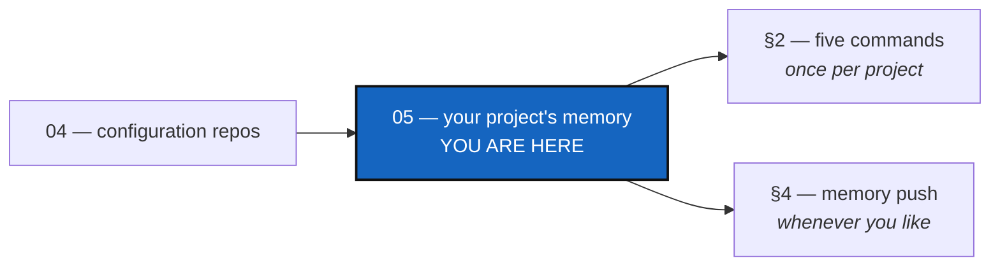

# Tutorial 5 of 5 — Your project's memory: keeping it, and keeping it safe

*Created: 2026-09-17*

## Abstract — read this first

**What this document is.** How to give a project a **memory** — a record of
what `cgitsync` did, kept in a repository of its own — from an empty account
to a memory that follows your project across branches and machines.

**Why it exists.** Every `cgitsync` command already writes a memory into
`.cgitsync/`. It lives on one disk, and a disk is one hard drive away from
gone. Turning it into a repository takes five commands that you run **once
per project, ever**. They are the only five in this tool most people meet
exactly once, which is why they get a tutorial of their own.

**What you will find.** What a memory is (§1), the five commands in order
(§2), how a memory follows your branches (§3), the day-to-day commands (§4),
what to do on a second machine (§5), and a summary (§6).

**Who it is for.** Anyone who has a working `cgitsync` tree. Do
[Tutorial 4](04_private_repos.md) first — a memory is a private repository,
and that tutorial is where private repositories are explained.

**What you need to do with it.** Work §2 once, on a real project. After
that, §4 is all you need.



---

> **Every command below is a Pixi task.** Run `pixi install` once per
> checkout, then always call the CLI as `pixi run cgitsync ...`.

## 1. What a memory is, and what it is not

Every command that changes your tree writes two things into `.cgitsync/`:

- a **State** — what the whole tree looked like, named after its own
  contents, so the same tree gets the same name on any machine;
- a **ledger entry** — that an operation happened, when, with which tool
  versions, and what it committed.

Together they answer questions Git cannot: *what did this whole tree look
like on the day of that release?*, and *what was that commit message, now
that the branch it was on is deleted?*

Check what you already have:

```bash
pixi run cgitsync memory status
```

```
states=14 entries=31 verification=verified
```

That memory is real, and it is on exactly one disk. The rest of this
tutorial is about that.

**A memory is not a backup of your code.** It holds no source, no diffs and
no files from your repositories — only what the tree *was* and what
`cgitsync` *did*. Your code is already in your repositories.

## 2. The five commands, once per project

The example is ComplexGitSync's own tree. Substitute your own names and the
sequence is identical.

### Step 1 — create the repository

One repository holds every project's memory, with one branch per project.
So you create it once, ever, for all your projects:

```bash
pixi run cgitsync repo create github:YOURNAME/.memory
```

```
repository=github:YOURNAME/.memory
remote_url=git@github.com:YOURNAME/.memory.git
created=yes
```

`cgitsync` does not have an account on GitHub and never asks you for one. It
runs `gh`, the GitHub command-line tool, which you have already signed in to
with `gh auth login`. **No password or token is ever read, stored or sent by
`cgitsync`.** GitLab and Codeberg work the same way, through `glab` and
`tea`.

If the tool is missing or signed out, the command prints exactly what to run
and stops. If the repository is already there — because you created it by
hand — it says `created=already-there` and carries on. Running it twice is
safe.

### Step 2 — tell your `.cgs` about it

```bash
pixi run cgitsync memory mount --cgs examples/complexgitsync4dev.cgs
```

```
entry={ repository = "github:YOURNAME/.memory", relative_path = ".cgitsync", default_branch = "ComplexGitSync", fallback_branch = "main", private = true, writable = true },
added=yes
```

One line is added to your `.cgs`, under `repos`. **Everything else in the
file is left exactly as it was**, comments included — the file is edited,
not regenerated.

Read that line and you will recognise every part of it from
[Tutorial 4](04_private_repos.md): it is an ordinary private, writable
repository. That is the whole design. Once mounted, a memory needs no
special commands, because it is not a special thing.

### Step 3 — make this memory *be* that repository

Your `.cgitsync/` is not empty — it has been filling up since your first
command. None of it may be lost, so you cannot clone over it:

```bash
pixi run cgitsync memory adopt
```

```
mount=/home/you/.cgs/CGS…/YourProject/.cgitsync
branch=YourProject_memory-dev
remote=git@github.com:YOURNAME/.memory.git
started_from=origin/main
waiting_to_be_committed=47
next: cgitsync memory push
```

The directory is now a repository, on your project branch's own memory
branch, with everything that was already there waiting to be committed.
Nothing was moved, overwritten or deleted.

### Step 4 — push it

```bash
pixi run cgitsync memory push
```

Your memory is now in two places. This is the point at which losing the disk
stops mattering.

### Step 5 — the branch your first merge will need

This step surprises people, so here is why it exists.

Your memory's branch is named after the project branch you are on. Work on
`memory-dev` and the memory lives on `YourProject_memory-dev`; work on
`main` and it lives on `YourProject`. When you merge `memory-dev` into
`main`, the memory merges too — but on a project whose memory was *born* on
a feature branch, the branch it would merge **into** has never existed.

So make it, before the merge:

```bash
pixi run cgitsync memory branch --project-branch main
```

```
branch=YourProject
for_project_branch=main
created=yes
pushed=yes
```

You will do this once for `main` and then never think about it again.

> **If you forget**, nothing breaks and nothing is silently lost: the merge
> tells you which branch is missing and names this command. `cgitsync` will
> not invent the branch for you, because a branch that does not exist is
> just as likely to be a typing mistake as a new branch.

## 3. After that: the memory follows your branches

Now merge as you always would:

```bash
pixi run cgitsync checkout main
pixi run cgitsync merge memory-dev --private
pixi run cgitsync merge memory-dev
pixi run cgitsync push --private && pixi run cgitsync push
```

Nothing in those four lines is about memory. That is the point of §2: after
it, the memory is carried by the commands you already use.

## 4. Day to day

```bash
pixi run cgitsync memory status         # how much is remembered, does it verify
pixi run cgitsync memory list           # every State, newest first
pixi run cgitsync memory show 2acdc98b  # one State: what was committed, and by whom
pixi run cgitsync memory push           # send what it has gained
```

`memory push` is a command you type, never something that happens to you.
Working offline costs you nothing: a memory is complete and verifiable on a
machine that has never seen a network, and it is pushed when you ask.

`cgitsync verify` is the one to run if you ever doubt what you are holding.
It answers **verified**, **no-history**, **legacy** or **corrupt**, and it
never repairs anything — a record that can be edited back into looking clean
would be evidence of nothing.

## 5. On a second machine

Somebody else, or the same you on a new laptop:

```bash
pixi run cgitsync memory clone
pixi run cgitsync memory status
```

```
states=14 entries=31 verification=verified
```

The same numbers as §1, on a machine that has never seen your first one.
That is what the whole tutorial was for.

## 6. Summary

| When | Command | What it does |
|---|---|---|
| Once, ever | `repo create <provider:owner/.memory>` | Creates the repository, through your provider's own tool |
| Once per project | `memory mount --cgs FILE` | Adds one entry to your `.cgs`, keeping the rest of the file |
| Once per project | `memory adopt` | Makes the memory you already have into that repository |
| Once per project | `memory branch --project-branch main` | Makes the branch your first merge will need |
| Whenever | `memory push` | Sends what the memory has gained |
| On a new machine | `memory clone` | Brings it back |

Three things worth remembering:

- **A memory is an ordinary private repository.** Everything in
  [Tutorial 4](04_private_repos.md) applies to it unchanged.
- **Nothing is automatic.** Every command above is one you type. A memory
  that pushed itself would push itself from the wrong machine one day.
- **`cgitsync` holds no credentials.** Creating a repository runs the tool
  you already signed in to; everything else is plain Git.
