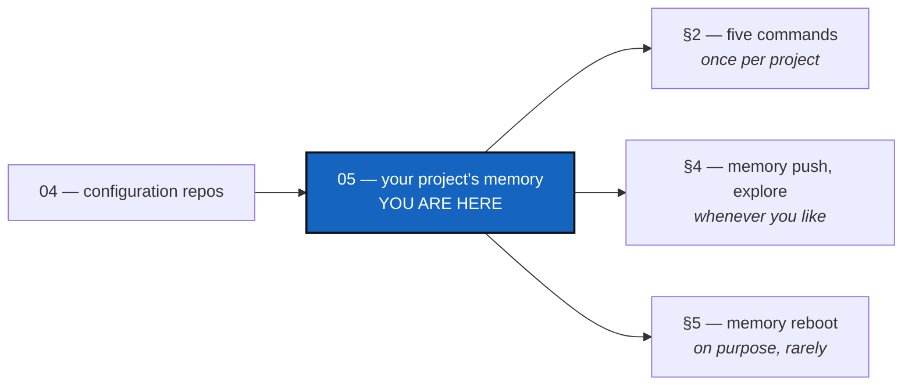

# Tutorial 5 of 5 — Your project's memory: keeping it, reading it, and starting it over

*Created: 2026-09-17*

## Abstract — read this first

**What this document is.** How to give a project a **memory** — a record of
what `cgitsync` did, kept in a repository of its own — from an empty account
to a memory that follows your project across branches and machines, can be
read without a hash, and can be started over on purpose without losing what
came before.

**Why it exists.** Every `cgitsync` command already writes a memory into
`.cgitsync/`. It lives on one disk, and a disk is one hard drive away from
gone. Turning it into a repository takes five commands that you run **once
per project, ever**. They are the only five in this tool most people meet
exactly once, which is why they get a tutorial of their own.

**What you will find.** What a memory is, and the two directories it
actually lives in (§1), the five commands in order (§2), how a memory
follows your branches (§3), the day-to-day commands including reading it
without a hash (§4), starting a memory's history over on purpose (§5), what
to do on a second machine (§6), and a summary (§7).

**Who it is for.** Anyone who has a working `cgitsync` tree. Do
[Tutorial 4](04_private_repos.md) first — a memory is a private repository,
and that tutorial is where private repositories are explained.

**What you need to do with it.** Work §2 once, on a real project. After
that, §4 is all you need — until the day you need §5.



---

> **Every command below is a Pixi task.** Run `pixi install` once per
> checkout, then always call the CLI as `pixi run cgitsync ...`.

## 1. What a memory is, and where it actually lives

Every command that changes your tree writes two things into `.cgitsync/`:

- a **State** — what the whole tree looked like, named after its own
  contents, so the same tree gets the same name on any machine;
- a **ledger entry** — that an operation happened, when, with which tool
  versions, and what it committed.

Together they answer questions Git cannot: *what did this whole tree look
like on the day of that release?*, and *what was that commit message, now
that the branch it was on is deleted?*

Check what you already have:

```bash
pixi run cgitsync memory status
```

```
states=14 entries=31 verification=verified
```

That memory is real, and it is on exactly one disk. The rest of this
tutorial is about that.

**A memory is not a backup of your code.** It holds no source, no diffs and
no files from your repositories — only what the tree *was* and what
`cgitsync` *did*. Your code is already in your repositories.

### The two directories, and why there are two

Once a memory is given a repository of its own (§2), it does not take over
`.cgitsync/` — it nests one level inside it, at **`.cgitsync/.memory`**.
The two halves have different jobs, and every command in this tutorial only
makes sense once you know which is which:

- **`.cgitsync/`** stays the workspace's own live state area — States, the
  ledger, commit logs, run logs — written by every command, whether or not
  a memory is mounted. This is the **pending** half: what has accumulated
  since the last time anybody sent it anywhere.
- **`.cgitsync/.memory`** is the git-tracked mount — an ordinary
  private/local repository, exactly like `.localSpec` or `.claude` from
  [Tutorial 4](04_private_repos.md). This is the **folded** half: what the
  last `memory push` actually committed and sent.

Only `memory push` moves content from one to the other (§4). That is what
lets `.cgitsync/.memory` be checked out, merged and pulled like any other
repository, with nothing about the workspace's own live writes getting in
its way — the day-to-day commands in this tutorial never mention the split
because you never have to manage it, but `memory reboot` (§5) touches both
halves deliberately, so it is worth knowing before you get there.

> A memory adopted before this split existed sits directly at `.cgitsync`
> instead. `cgitsync memory migrate [--cgs FILE]` moves it onto the layout
> above once, in place — history unchanged, nothing re-cloned. A fresh
> `memory adopt` never needs this: it mounts at `.cgitsync/.memory`
> directly.

## 2. The five commands, once per project

The example is ComplexGitSync's own tree. Substitute your own names and the
sequence is identical.

### Step 1 — create the repository

One repository holds every project's memory, with one branch per project.
So you create it once, ever, for all your projects:

```bash
pixi run cgitsync repo create github:YOURNAME/.memory
```

```
repository=github:YOURNAME/.memory
remote_url=git@github.com:YOURNAME/.memory.git
created=yes
```

`cgitsync` does not have an account on GitHub and never asks you for one. It
runs `gh`, the GitHub command-line tool, which you have already signed in to
with `gh auth login`. **No password or token is ever read, stored or sent by
`cgitsync`.** GitLab and Codeberg work the same way, through `glab` and
`tea`.

If the tool is missing or signed out, the command prints exactly what to run
and stops. If the repository is already there — because you created it by
hand — it says `created=already-there` and carries on. Running it twice is
safe.

### Step 2 — tell your `.cgs` about it

```bash
pixi run cgitsync memory mount --cgs examples/complexgitsync4dev.cgs
```

```
cgs=examples/complexgitsync4dev.cgs
entry={ repository = "github:YOURNAME/.memory", relative_path = ".cgitsync/.memory", default_branch = "ComplexGitSync", fallback_branch = "main", private = true, writable = true, nested_config = "disabled" },
added=yes
```

One line is added to your `.cgs`, under `repos`. **Everything else in the
file is left exactly as it was**, comments included — the file is edited,
not regenerated.

Read that line and you will recognise most of it from
[Tutorial 4](04_private_repos.md): it is an ordinary private, writable
repository, mounted at `.cgitsync/.memory` (§1) rather than at the tree's
own name. `nested_config = "disabled"` is the one field a memory adds: it
is a leaf that holds its own `.cgs/` directory of exported specs (§5), and
that must never be mistaken for a nested project to descend into.

### Step 3 — make this memory *be* that repository

Your `.cgitsync/` is not empty — it has been filling up since your first
command. None of it may be lost, so you cannot clone over it:

```bash
pixi run cgitsync memory adopt
```

```
mount=/home/you/.cgs/CGS…/YourProject/.cgitsync/.memory
branch=YourProject_memory-dev
remote=git@github.com:YOURNAME/.memory.git
started_from=origin/main
waiting_to_be_committed=47
next: cgitsync memory push
```

`.cgitsync/.memory` is created fresh and turns into that repository, on
your project branch's own memory branch. It starts **empty** — nothing is
moved into it yet; the pending count above is still sitting in `.cgitsync`
itself, waiting for the next step to fold it in.

> **Adopting fresh instead of carrying history forward.** `started_from`
> above means this branch begins from your project's own fallback branch,
> sharing its history — the normal case. If you are adopting a memory for
> the very first time and want it to start with **no** inherited history
> at all, add `--reboot`: `cgitsync memory adopt --reboot`. It adopts the
> same repository identity but leaves the branch exactly as empty as
> `init` made it. This is the one-time version of §5's `memory reboot`;
> ordinary `memory adopt` — appending — stays the default.

### Step 4 — push it

```bash
pixi run cgitsync memory push
```

This is the command that performs the fold §1 described: everything
`.cgitsync` was holding pending moves into `.cgitsync/.memory`, gets
committed, and is pushed. Your memory is now in two places. This is the
point at which losing the disk stops mattering.

### Step 5 — the branch your first merge will need

This step surprises people, so here is why it exists.

Your memory's branch is named after the project branch you are on. Work on
`memory-dev` and the memory lives on `YourProject_memory-dev`; work on
`main` and it lives on `YourProject`. When you merge `memory-dev` into
`main`, the memory merges too — but on a project whose memory was *born* on
a feature branch, the branch it would merge **into** has never existed.

So make it, before the merge:

```bash
pixi run cgitsync memory branch --project-branch main
```

```
branch=YourProject
for_project_branch=main
created=yes
pushed=yes
```

You will do this once for `main` and then never think about it again.

> **If you forget**, nothing breaks and nothing is silently lost: the merge
> tells you which branch is missing and names this command. `cgitsync` will
> not invent the branch for you, because a branch that does not exist is
> just as likely to be a typing mistake as a new branch.

## 3. After that: the memory follows your branches

Now merge as you always would:

```bash
pixi run cgitsync checkout main
pixi run cgitsync merge memory-dev --private
pixi run cgitsync merge memory-dev
pixi run cgitsync push --private && pixi run cgitsync push
```

Nothing in those four lines is about memory. That is the point of §2: after
it, the memory is carried by the commands you already use — `checkout`,
`merge` and `push` reach `.cgitsync/.memory` exactly the way they reach
`.localSpec` or `.claude`, because it is exactly the same kind of
repository.

> **If you are about to reboot the memory as part of this merge** (§5),
> read the note in §5.1 before running the four lines above — the order
> you do the two in changes what your merged memory looks like afterward.

## 4. Day to day

```bash
pixi run cgitsync memory status         # how much is remembered, does it verify
pixi run cgitsync memory list           # every State, newest first
pixi run cgitsync memory show 2acdc98b  # one State: what was committed, and by whom
pixi run cgitsync memory explore        # published commits, newest push first — no hash needed
pixi run cgitsync memory push           # send what it has gained
```

`memory push` is a command you type, never something that happens to you.
Working offline costs you nothing: a memory is complete and verifiable on a
machine that has never seen a network, and it is pushed when you ask.

`memory show` needs a State's hash — useful once you already have one.
`memory explore` is for when you do not: it reads as *what a colleague
pulling this branch would see*, one row per published commit, on the branch
checked out here.

```
$ pixi run cgitsync memory explore
branch=YourProject_memory-dev (current)
2026-09-18  YourProject         memory-dev   9140e14  memory reboot closes a chapter and opens the next
2026-09-17  .localSpec          memory-dev   881d5b1  (private) same commit, folded in
```

`--timeline` reads the ledger straight through instead — every entry, in
the order it happened, `checkout`/`merge`/`push` included, not only commits:

```bash
pixi run cgitsync memory explore --timeline
```

```
seq=31  2026-09-17T10:11:00Z  commit
    commit  YourProject         71f3a9f  a State's hash no longer depends on...
seq=32  2026-09-17T10:11:05Z  push
    push    YourProject         -> github:you/YourProject refs/heads/memory-dev
```

`cgitsync verify` is the one to run if you ever doubt what you are holding.
It answers **verified**, **no-history**, **legacy** or **corrupt**, and it
never repairs anything — a record that can be edited back into looking clean
would be evidence of nothing.

## 5. Starting a memory's history over, on purpose

A project's shape changes — repositories added, removed, restructured —
and a memory built for the old shape is not wrong, exactly, but it stops
being a clean answer to "what does this project look like." `memory reboot`
closes the current chapter and opens a fresh one:

```bash
pixi run cgitsync memory reboot
```

```
folded=12 pending record(s)
archived=YourProject_memory-dev -> YourProject_memory-dev.archived-20260918
exported=.cgitsync/.memory/.cgs/YourProject-v2.cgs
branch=YourProject_memory-dev (fresh, empty)
next: use the tool as normal — the next command writes this branch's first State
```

In order:

1. **Whatever `.cgitsync` is holding pending is folded in and pushed**
   first, under the branch's current name — the same fold `memory push`
   performs, so nothing you have run since your last push is lost to the
   reboot.
2. **The tree's current shape is exported** — from the `.gts` you are
   working from, never a hand-authored file — to a permanent, versioned
   `.cgitsync/.memory/.cgs/<project>-v<N>.cgs`. `N` increments once per
   reboot and is never reused: `.cgitsync/.memory/.cgs/` becomes an ordered
   record of every shape this project's memory has ever described, and
   that record is the one thing the next step does not clear.
3. **The branch is archived** — pushed to origin under
   `<branch>.archived-<date>` *before* its old name is removed from
   origin, so the commits are always reachable under some name on the
   remote, never for less than an instant unreachable. Locally, the branch
   is renamed to match.
4. **A fresh branch is created under the original name.** Its States, the
   ledger, commit logs and run logs are cleared, so its first commit is a
   true beginning — nothing is committed yet; the next ordinary command
   does that, exactly like a freshly adopted mount.

**The fresh branch is local only until you push it.** A reboot never
pushes the new branch — the same rule `memory push`'s own commit step
follows. So `cgitsync status` straight after a reboot shows the memory
with no upstream, and that is correct rather than broken:

```
REPOSITORY  PATH               SCOPE          LOCAL_BRANCH  UPSTREAM_BRANCH  SYNC
.memory     .cgitsync/.memory  private/local  YourProject   -                no-upstream
```

`-` and `no-upstream` mean "this branch has never been pushed, so there is
nothing to measure it against". One command settles it:

```bash
pixi run cgitsync memory push
```

That folds anything pending, commits it, pushes the branch **and sets its
upstream**, after which the same row reads `origin/YourProject` and
`synced`. It is worth running even when the reboot left nothing to commit:
the push still sets the tracking the row is waiting for. `cgitsync push
--private`, which pushes every private repository in the tree, sets it too
and reports `(upstream set)` when it does.

> **`memory branch` is not a substitute here.** It publishes the branch,
> so the commits reach origin, but it does not set your local tracking —
> `status` keeps showing `-` afterwards. Its job is to create the branch a
> later merge will need (§2, Step 5), not to connect the branch you are
> on. Run `memory push`.

**Nothing is ever force-pushed or deleted.** The old branch is renamed and
kept, reachable for as long as anyone wants it:

```bash
git -C .cgitsync/.memory checkout YourProject_memory-dev.archived-20260918
# or, on a second machine:
pixi run cgitsync memory clone --branch YourProject_memory-dev.archived-20260918
```

`cgitsync verify`, run against a checkout of the archived branch, answers
exactly as it did the day before the reboot — archiving is a rename, not an
edit.

### 5.1 Rebooting as part of a merge to `main`

Reboot acts on whichever branch is checked out **when you run it** — so
rebooting while you are on `memory-dev` reboots `YourProject_memory-dev`
only, not `main`'s own memory. That matters for the order you do things in:

| Order | What you get |
|---|---|
| **Reboot `memory-dev` first, merge second (recommended only if you do not intend to merge the memory branches)** | `memory-dev`'s memory is fresh going forward. But its rebooted branch shares no history with `YourProject` any more — merging it into `main`'s memory afterward is merging two unrelated histories, which needs `--allow-unrelated-histories` and is rarely what you want. |
| **Merge everything first, reboot `main` afterward (recommended)** | Run §3's four lines exactly as they stand today — `merge memory-dev --private` and `merge memory-dev` bring the *whole* memory-dev history into `main`'s memory branch, same as any other day. Once that is done and pushed, `checkout main` and run `memory reboot` there. `main`'s memory now holds everything up to and including the merge, archived under one name, and starts the next chapter clean. |

The second order is the one to reach for before folding a long-running
branch like `memory-dev` into `main`: it keeps the full, real history of
the work that just landed, in one archived branch, and gives `main`'s
memory a fresh start exactly at the milestone the merge represents —
rather than discarding memory-dev's own accumulated history from ever
reaching `main` at all.

### 5.2 Adopting fresh instead of rebooting later

If you are mounting a memory for the very first time and already know you
do not want to inherit whatever the fallback branch holds, `memory adopt
--reboot` (§2, Step 3) does in one step what `memory adopt` followed by
`memory reboot` would do in two.

## 6. On a second machine

Somebody else, or the same you on a new laptop:

```bash
pixi run cgitsync memory clone
pixi run cgitsync memory status
```

```
states=14 entries=31 verification=verified
```

The same numbers as §1, on a machine that has never seen your first one.
That is what the whole tutorial was for.

## 7. Summary

| When | Command | What it does |
|---|---|---|
| Once, ever | `repo create <provider:owner/.memory>` | Creates the repository, through your provider's own tool |
| Once per project | `memory mount --cgs FILE` | Adds one entry to your `.cgs`, keeping the rest of the file |
| Once per project | `memory adopt [--reboot]` | Makes the memory you already have into that repository — fresh, or history inherited |
| Once per project | `memory branch --project-branch main` | Makes the branch your first merge will need |
| Whenever | `memory push` | Sends what the memory has gained, and sets the branch's upstream — the command to run after a reboot (§5) |
| Whenever | `memory explore [--timeline]` | Reads the memory by branch, or the whole ledger in order — no hash needed |
| Rarely, on purpose | `memory reboot` | Archives the current branch, exports the current shape, starts a fresh empty branch under the same name |
| On a new machine | `memory clone [--branch NAME]` | Brings it back — the live branch, or an archived one by name |

Four things worth remembering:

- **A memory is an ordinary private repository.** Everything in
  [Tutorial 4](04_private_repos.md) applies to it, at `.cgitsync/.memory`
  (§1) rather than at the tree's own name.
- **Nothing is automatic.** Every command above is one you type. A memory
  that pushed itself would push itself from the wrong machine one day.
- **`cgitsync` holds no credentials.** Creating a repository runs the tool
  you already signed in to; everything else is plain Git.
- **Nothing is ever force-pushed or deleted, reboot included.** The worst
  a mistake here costs you is an extra archived branch nobody reads again
  — never a lost one.
