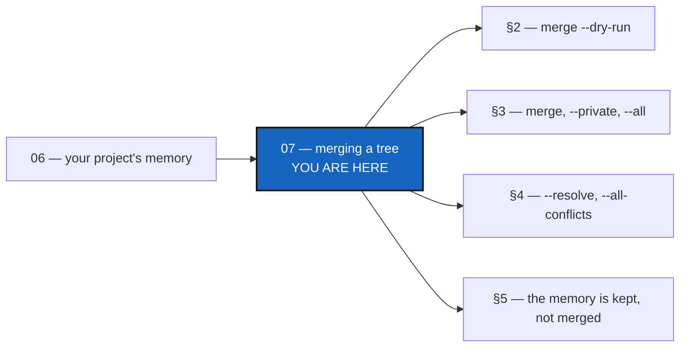

# Tutorial 7 of 7 — Merging a tree: scopes, conflicts, the memory, and what to do afterwards

*Created: 2026-10-09*

## Abstract — read this first

**What this document is.** How to merge a project branch across a whole tree
with `cgitsync merge`: what it does and in what order, how to look before you
merge, the three scopes, what happens when something conflicts, what happens to
the memory, and what to do when two branches share no history.

**Why it exists.** Merging is the hardest everyday task in Git, and harder in
a tree of repositories where some are private and one is a memory. The pieces
are spread over [Tutorial 5](05_private_repos.md), [Tutorial 6](06_memory.md)
and the user guide; this is the one place that teaches merge from start to
finish.

**What you will find.** What a tree merge is (§1), the preview (§2), the
scopes (§3), conflicts and `--resolve` (§4), the memory (§5), unrelated
histories (§6), the steps after the merge (§7), and a summary table (§8).

**Who it is for.** Anyone who has a tree, private repositories
([Tutorial 5](05_private_repos.md)) and a memory ([Tutorial 6](06_memory.md)).

**What you need to do with it.** Read §1–§3 before your first tree merge; keep
§4 and §8 at hand for the day something stops.



---

> **Every command below is a Pixi task.** Run `pixi install` once per
> checkout, then always call the CLI as `pixi run cgitsync ...`.

The examples merge the project branch `feature` into `main`.

## 1. What a tree merge is

`merge feature` merges, in every repository of the scope, the branch that
belongs to `feature` into the branch that repository has checked out. It works
leaf first, and project repositories before private ones. Check out the target
first:

```bash
pixi run cgitsync checkout main
pixi run cgitsync merge feature
```

or let one command do both, which matters when `main` holds an older
ComplexGitSync (a separate `checkout` would install that older build):

```bash
pixi run cgitsync merge feature --into main
```

By default a merge is **all or nothing**: every repository is checked first,
and if any would conflict, nothing is merged and the message names each one.

## 2. Look before you merge

```bash
pixi run cgitsync merge feature --dry-run
```

It prints `plan_order=` — each repository, its target and the branch it would
merge — and marks the ones that need attention: `already merged`, a memory
(`its own side is kept whole, the source stays as history`), `no commit in
common`, or a conflict with its files. Nothing is changed. A configuration
repository does not merge `feature`; it merges the branch derived from it
(`<default>_feature`), which is why the plan names the branch per repository.

## 3. The three scopes

| Command | Merges |
|---|---|
| `merge feature` | this project's own repositories |
| `merge feature --private` | the writable private repositories, each its derived branch `<default>_feature` |
| `merge feature --all` | both, in one pass |

Read-only configuration repositories never move, in any scope.

## 4. When something conflicts

The default stops before touching anything. When you would rather go on:

```bash
pixi run cgitsync merge feature --all --resolve
```

`--resolve` merges one repository at a time and **stops at the first conflict**,
leaving the markers in that worktree and opening your merge tool. What was
merged before stays merged, so the tree can be left half merged; the message
lists what was merged and what was not reached.

```bash
pixi run cgitsync merge feature --all --resolve --all-conflicts
```

`--all-conflicts` goes on past a **text** conflict once your merge tool has
resolved it: it commits that merge (`Merge branch '<source>'`), lists it with
the others as merged, and continues. It
stops, naming the repository, on:

- two branches with no commit in common (§6);
- a **binary** file in conflict — it says which file, and that Git keeps this
  branch's version; nothing is staged for you;
- a file the tool left unresolved;
- no merge tool available — it prints the command to run by hand.

It never resolves, regenerates or stages a file you were not told about. If you
stop, finish by hand: resolve, `pixi run cgitsync add`, `pixi run cgitsync
commit`, then run the merge again — the repositories already merged have
nothing left to take and are passed over.

## 5. The memory

A memory is a hash chain of numbered files, so two memories that grew apart
hold different entries under the same numbers; merging them file by file would
collide or interleave them. So **no merge mode ever merges a memory file by
file**, `--resolve` and `--all-conflicts` included, and a memory is never a
stop. `merge` keeps the memory of the branch you merge *into* whole and records
the other as history:

```
kept .memory: its own memory stays whole; demo_feature is kept as history
```

To continue the other chain instead, say so:

```bash
pixi run cgitsync memory merge feature --into main --theirs   # keep feature's memory
pixi run cgitsync memory merge feature --into main --ours     # keep main's (what merge did)
```

## 6. Two branches with no common commit

A repository whose branches share no commit (a memory rebooted on one side is
the usual cause, a repository started afresh the other) is refused by name:

```
conf: 'demo_feature' and 'demo' share no commit; Git will not merge unrelated histories
```

Nothing is merged, and no `--resolve` is offered, because `--resolve` would
only run the same refusal. Fix the cause — usually the wrong branch name — or
leave that repository out of the scope. Under `--resolve`, the run stops there
by name and ends; it never loops.

## 7. After the merge

```bash
pixi run cgitsync status                  # errors=0
pixi run cgitsync push --private && pixi run cgitsync push
pixi run cgitsync branch close feature    # keeps what only feature held, renames it closed/feature
pixi run cgitsync branch delete feature   # deletes nothing until every repository is safe or recorded
```

A closed branch's memory is safe once merged: it is reachable from the target,
and `branch close` records anything it alone holds before renaming it.

## 8. Summary

| Situation | Command |
|---|---|
| Merge my project's repositories | `merge feature` |
| Merge from a branch without checking out the target | `merge feature --into main` |
| See the plan first | `merge feature --dry-run` |
| Include the private repositories | `merge feature --all` |
| A conflict stopped everything | `merge feature --all --resolve` |
| Keep going through text conflicts | `merge feature --all --resolve --all-conflicts` |
| I want the other branch's memory | `memory merge feature --into main --theirs` |
| "share no commit" | fix the branch name or leave that repository out |
| Merged and pushed | `branch close feature`, then `branch delete feature` |
