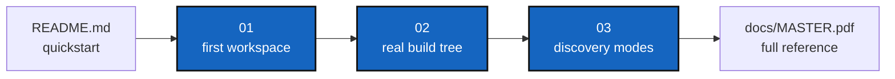

# Tutorials

*Created: 2026-08-25*

## Abstract — read this first

**What this document is.** The index of ComplexGitSync's three worked
tutorials, ordered from simplest to most advanced.

**Why it exists.** The root [README.md](../README.md) covers the CLI
command-by-command; these tutorials instead walk one topology end to end,
so a first-time user sees the full lifecycle before hand-authoring their
own `.cgs`.

**What you will find.** Three tutorials, each building on the last, plus a
reminder that every command shown is a Pixi task.

**Who it is for.** Anyone new to `cgitsync`. Start at Tutorial 1 regardless
of your own project's shape — it establishes the vocabulary the other two
assume.

**What you need to do with it.** Work the tutorials in order, or jump
straight to whichever matches your own project's situation (the root
README's "Adopting a project" table links back here per-situation).

---

Three worked examples, ordered from the simplest to the most advanced. Do
them in order — each one builds on the last:

1. **[01 — Your First Multi-Repo Workspace](01_first_multi_repo_workspace.md)**
   The complete `cgitsync` lifecycle (validate → initialise → add → commit →
   push → freeze → release) on a small synthetic sandbox topology
   (`CGSil1`). Start here.
2. **[02 — Onboarding a Real Build Tree](02_onboarding_a_real_build_tree.md)**
   The same hand-authored `.cgs` style from Tutorial 1, applied to a real,
   19-repository project (`cawaqs`) — and where `cgitsync` hands off to the
   project's own build.
3. **[03 — Configuration Discovery Modes](03_configuration_discovery_modes.md)**
   The most advanced tutorial: a real project with no `.cgs` of its own
   (`cawaqsviz`), reached three different ways — hand-authored, `discover`
   from a checkout, and migrated from git submodules with
   `import-submodules`.

> **Every command in these tutorials is a Pixi task.** Run `pixi install`
> once per checkout, then always invoke the CLI as `pixi run cgitsync ...`
> — never as a bare `cgitsync ...`, which the shell will not find.

For full command-by-command reference (every flag, every document format),
see [docs/MASTER.pdf](../docs/MASTER.pdf) (source: [docs/Text/](../docs/Text/))
or the top-level [README.md](../README.md).
