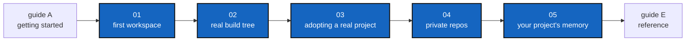

# Tutorials

*Created: 2026-08-25*

## Abstract — read this first

**What this document is.** The index of ComplexGitSync's five worked
tutorials, ordered from simplest to most advanced.

**Why it exists.** The [guides](../guide/A-getting-started.md) explain each
topic. These tutorials instead walk one real tree end to end, command by
command, so you see the whole lifecycle before running it on your own
project.

**Who it is for.** Anyone new to `cgitsync`. Read
[guide A](../guide/A-getting-started.md) for the vocabulary, then start at
Tutorial 1 whatever your own project looks like.

**What you need to do with it.** Work the tutorials in order, or jump to
the one that matches your project's situation.

```mermaid
graph LR
    G1["guide A<br/>getting started"] --> T1["01<br/>first workspace"]
    T1 --> T2["02<br/>real build tree"]
    T2 --> T3["03<br/>adopting a real project"]
    T3 --> T4["04<br/>private repos"]
    T4 --> T5["05<br/>your project's memory"]
    T5 --> REF["guide E<br/>reference"]

    classDef here fill:#1565C0,color:#fff,stroke:#111,stroke-width:2px;
    class T1,T2,T3,T4,T5 here;
```

---

| # | Tutorial | Install | Goes with |
|---|---|---|---|
| 1 | **[Your First Multi-Repo Workspace](01_first_multi_repo_workspace.md)**: the complete lifecycle (validate → initialise → add → commit → push → freeze → release) on a small synthetic tree (`CGSil1`), with the standalone variant alongside. Start here. | nested (standalone shown) | [guide A](../guide/A-getting-started.md) |
| 2 | **[Onboarding a Real Build Tree](02_onboarding_a_real_build_tree.md)**: a hand-written `.cgs` for a real 19-repository project (`cawaqs`), a feature branch across all of it, then hand-off to its own build. | standalone | [guide B](../guide/B-bringing-in-a-project.md) |
| 3 | **[Adopting a Real Project: CaWaQS-Viz](03_adopting_a_real_project.md)**: a real project with no `.cgs` that still uses git submodules, adopted in place, from `git clone` to a pushed `READY` tree. | **nested** (required to adopt in place) | [guide B](../guide/B-bringing-in-a-project.md#4-the-project-uses-git-submodules) |
| 4 | **[Private repos](04_private_repos.md)**: the repositories that configure your project rather than being it: read-only shared ones, writable ones of your own, and how their branches follow yours. | standalone | [guide C](../guide/C-working-day-to-day.md#5-private-repos-in-daily-use) |
| 5 | **[Your project's memory](05_memory.md)**: what `cgitsync` remembers, `memory setup` to give it a repository of its own, reading it without a hash, and starting it over on purpose. | either | [guide D](../guide/D-memory.md) |

> **Every command in these tutorials is a Pixi task.** Run `pixi install`
> once per checkout, then always invoke the CLI as `pixi run cgitsync ...`.
> A bare `cgitsync ...` won't be found by your shell.

For every command and option, see [guide E — Reference](../guide/E-reference.md).
