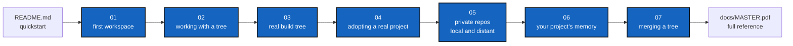

# Tutorials

*Created: 2026-08-25*

## Abstract — read this first

**What this document is.** The index of ComplexGitSync's seven worked
tutorials, ordered from simplest to most advanced.

**Why it exists.** The root [README.md](../README.md) says what the tool
is for and which tutorial fits which case, and the user guide in
[docs/MASTER.pdf](../docs/MASTER.pdf) covers every command; these
tutorials instead walk one topology end to end,
so a first-time user sees the full lifecycle before hand-authoring their
own `.cgs`.

**What you will find.** Seven tutorials, each building on the last, plus a
reminder that every command shown is a Pixi task.

**Who it is for.** Anyone new to `cgitsync`. Start at Tutorial 1 regardless
of your own project's shape — it establishes the vocabulary the other six
assume.

**What you need to do with it.** Work the tutorials in order, or jump
straight to whichever matches your own project's situation.

```mermaid
graph LR
    README["README.md<br/>quickstart"] --> T1["01<br/>first workspace"]
    T1 --> T2["02<br/>working with a tree"]
    T2 --> T3["03<br/>real build tree"]
    T3 --> T4["04<br/>adopting a real project"]
    T4 --> T5["05<br/>private repos<br/>local and distant"]
    T5 --> T6["06<br/>your project's memory"]
    T6 --> T7["07<br/>merging a tree"]
    T7 --> REF["docs/MASTER.pdf<br/>full reference"]

    classDef here fill:#1565C0,color:#fff,stroke:#111,stroke-width:2px;
    class T1,T2,T3,T4,T5,T6,T7 here;
```

---

Seven worked examples, ordered from the simplest to the most advanced. Do
them in order — each one builds on the last:

1. **[01 — Your First Multi-Repo Workspace](01_first_multi_repo_workspace.md)**
   Install a small sandbox tree (`CGSil1`) in either of the two modes —
   standalone with `bootstrap`, the usual one, or nested with `initialise`
   — and see the difference. Start here.
2. **[02 — Working with a Tree](02_working_with_a_tree.md)**
   The everyday commands on a READY tree: change files, then `add`,
   `commit`, `push`, `tag` and `freeze-release` across every repository at
   once, and go back to a release from its `.gts` State.
3. **[03 — Onboarding a Real Build Tree](03_onboarding_a_real_build_tree.md)**
   The same hand-authored `.cgs` style from Tutorial 1, applied to a real,
   19-repository project (`cawaqs`) — and where `cgitsync` hands off to the
   project's own build.
4. **[04 — Adopting a Real Project: CaWaQS-Viz](04_adopting_a_real_project.md)**
   The messiest starting point: a real project (`cawaqsviz`) with no `.cgs`
   of its own that still uses git submodules — one real, verified, ten-step
   procedure from `git clone` to a pushed, `READY` tree.
5. **[05 — Private repos: the ones that configure your project](05_private_repos.md)**
   Repositories you share between projects: how `private = true` declares
   one, why branch moves skip it but commit and push do not, and the safe
   order for shipping a change — run against ComplexGitSync's own tree.
6. **[06 — Your project's memory](06_memory.md)**
   What `cgitsync` remembers about your tree, and `cgitsync memory setup` —
   one command, run at any time — or the five it stands for, that turn that memory into a repository of its own, so
   it survives the disk it was made on and follows your project across
   branches and machines. Also: reading it without a hash (`memory
   explore`), and starting its history over on purpose without losing what
   came before (`memory reboot`).
7. **[07 — Merging a tree](07_merge.md)**
   `cgitsync merge` end to end: the preview, the three scopes, `--into`,
   what `--resolve` and `--all-conflicts` do and never do, why the memory is
   kept rather than merged, branches with no common commit, and closing the
   branch afterwards.

> **Every command in these tutorials is a Pixi task.** Run `pixi install`
> once per checkout, then always invoke the CLI as `pixi run cgitsync ...`
> — never as a bare `cgitsync ...`, which the shell will not find.

For full command-by-command reference (every flag, every document format),
see [docs/MASTER.pdf](../docs/MASTER.pdf) (source: [docs/Text/](../docs/Text/))
or the top-level [README.md](../README.md).
